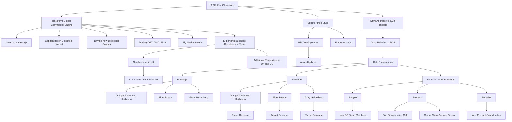

## Risks

| Risk ID | Risk Description | Risk Probability | Risk Impact | Risk Response|Risk Type|
|---|---|---|---|---|---|
|R01|Failure to meet aggressive 2023 targets| High | High | Re-evaluate and adjust targets, focus on increasing bookings and revenue|Financial, Strategic|
|R02|Inability to maintain growth in revenue| High | High | Increase bookings, expand business development team, diversify product offerings|Financial, Strategic|
|R03|Insufficient bookings to sustain growth| High | High | Expand business development team, improve sales processes, diversify product offerings|Financial, Strategic|
|R04|Delay in hiring key business development personnel| Medium | Medium | Expedite hiring process, consider temporary or contract hires|Operational, Strategic|
|R05|Dependence on new hires to bring in large client base| Medium | High | Diversify client acquisition strategies, invest in marketing and networking|Operational, Strategic|
|R06|Failure to capitalize on the biosimilar market, new biological entities, and CGT, CMC, and BioA| Medium | High | Invest in research and development, improve sales and marketing strategies in these areas|Strategic, Economic|
|R07|Inability to quickly adapt to market changes and client needs| Medium | High | Improve market research and client feedback processes, invest in agile business strategies|Strategic, Economic|
|R08|Potential reputational risk if HR developments are not well-received| Low | Medium | Ensure transparent and effective communication, invest in employee engagement and satisfaction measures|Reputation, Operational|

## Diagram

This diagram represents the key objectives for 2023, the actions taken to achieve these objectives, and the people involved in these actions. The diagram also shows the process of transforming the global commercial engine, driving aggressive 2023 targets, and building for the future. It also includes the data presentation and the focus on more bookings to drive revenue. The diagram also shows the people, process, and portfolio aspects of driving more bookings.

