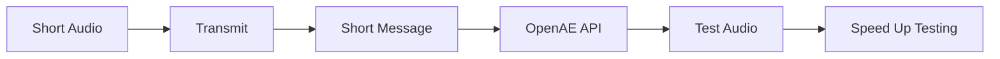

## Abstract Summary

The text discusses a brief audio clip used to transmit a short message to the OpenAE's API. This audio is primarily used for testing purposes to expedite the process.

## Key Points

1. The audio is short and used for transmitting a brief message to OpenAE's API.
2. The purpose of the audio is to expedite testing.
3. The audio is used as a test audio.

## Risks

The provided text does not contain any information related to risks, threats, or issues that could harm a business. Therefore, it's not possible to identify or list any main risks based on this text.

## Action Items

No action items can be identified from the provided text.

## Sentiment

The sentiment of the text is neutral. The text is purely informational and factual, describing the purpose of a short audio. There are no words or phrases that express any positive or negative emotions or opinions.

## Diagram

Here is a mermaid diagram representation of the text:

In this diagram:

- "Short Audio" is the initial state.
- "Transmit" is the action taken on the "Short Audio".
- "Short Message" is the result of the "Transmit" action.
- "OpenAE API" is the entity that receives the "Short Message".
- "Test Audio" is the state of the "Short Message" after it is received by the "OpenAE API".
- "Speed Up Testing" is the final state or the goal of the process.

